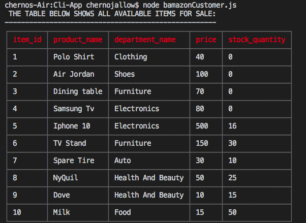

# Technologies:  Node.js & MySQL

The application will take in orders from customers and deplete stock from the store's inventory. Customers can view the current items available for purchase. They can prompted to enter the item id# and how many products they want to purchase.
If the products are in stock, order can be completed and they will see the total cost of their orders.

